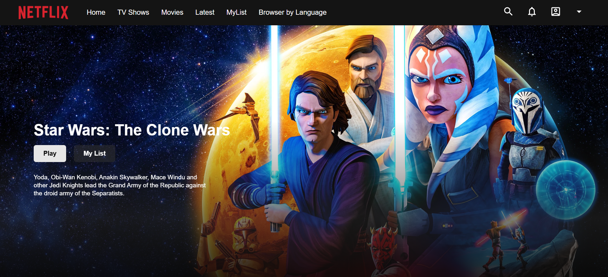

# 🎬 Netflix Clone 2025

## Introduction

Netflix Clone 2025 is a modern web application that replicates the core functionalities of Netflix. It allows users to browse movies, watch trailers, and experience a sleek, responsive UI. The project is built using the latest technologies, including React.js, Node.js, and TMDb API for fetching movie data.

🌐 **Live Demo**: [netflix-clone.netlify.app](https://dreamy-souffle-72bb3a.netlify.app)


---

## 📸 Preview



---

## Features

- 🎬 **Browse Movies & TV Shows** - Fetches real-time data from TMDb API.
- 🔍 **Search Functionality** - Quickly find movies and TV shows.
- 📺 **Movie Trailers** - Watch YouTube trailers directly from the app.
- 📱 **Fully Responsive** - Optimized for all screen sizes.

## Tech Stack

| Technology    | Description                              |
|--------------|----------------------------------|
| React.js     | Frontend framework for building UI |
| TMDb API     | Fetch movie and TV show data |

## Installation & Setup

### Prerequisites

- **TMDb API Key** (Sign up at [TMDb](https://www.themoviedb.org/))

### Steps to Install

1. **Clone the repository**  
   ```bash
   git clone https://github.com/amirmub/Netflix-Clone-2025.git
   cd Netflix-Clone-2025
   ```

2. **Install dependencies**  
   ```bash
   npm install
   ```

3. **Set up environment variables**  
   - Create a `.env` file in the root directory.  
   - Add the following values:  
     ```env
     REACT_APP_TMDB_API_KEY=your_tmdb_api_key
     REACT_APP_FIREBASE_API_KEY=your_firebase_api_key
     ```

4. **Start the development server**  
   ```bash
   npm start
   ```
   - Open **[http://localhost:5173](http://localhost:5173)** in your browser.


## API Integration

- **TMDb API** is used to fetch movie details, posters, and trailers.  

## Contributing

Contributions are welcome! 🚀 Follow these steps:

1. **Fork the repository**
2. **Create a feature branch** (`git checkout -b feature-name`)
3. **Commit your changes** (`git commit -m 'Add feature'`)
4. **Push to the branch** (`git push origin feature-name`)
5. **Create a Pull Request**


## Contact

For queries or feedback, reach out at:  
📧 **Email:** amirmubarek01@gmail.com  
📌 **GitHub:** [amirmub](https://github.com/amirmub)


